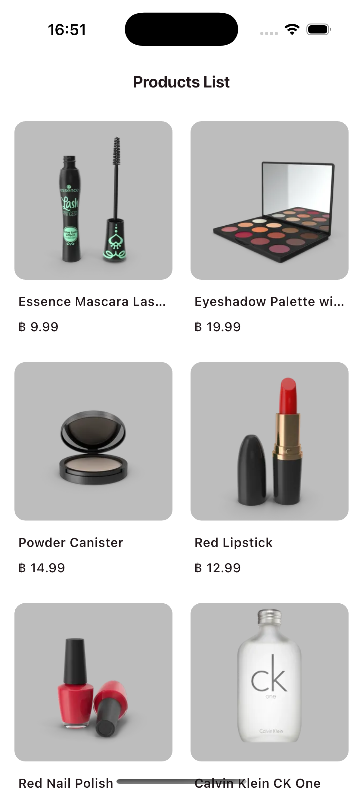
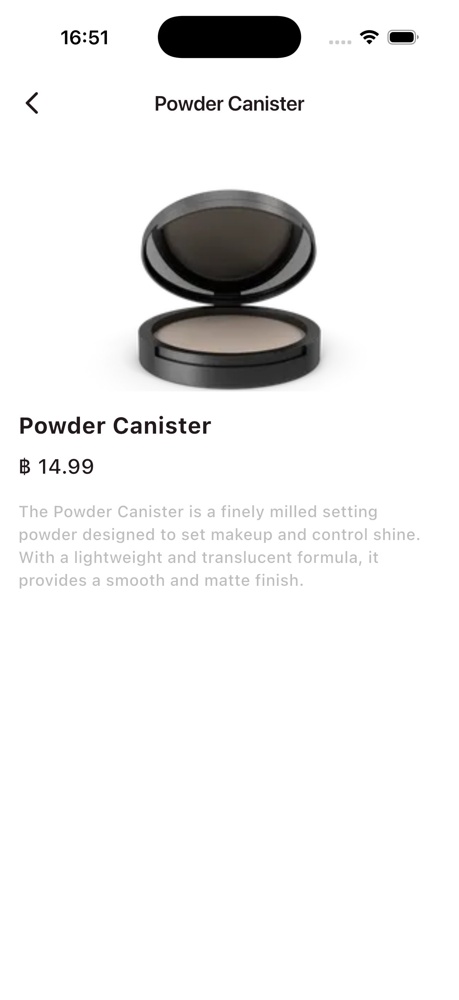

# product_test

A new Flutter project Product List Test.

  
  

<li> จัดการ state ของหน้า Product List ด้วย Cubit (flutter_bloc) โดยให้มี 3 สถานะหลักใน ProductsState คือ loading / data / error </li>
<li>  ตอนเริ่มโหลดหรือกด Retry: Cubit เรียก load() แล้ว emit(loading: true, error: null) เพื่อให้หน้าแสดง CircularProgressIndicator </li>

<li> ถ้าโหลดสำเร็จ: Cubit ดึงข้อมูลจาก repository.fetchProducts() แล้ว emit(loading: false, products: items) หน้าเลยไปแสดง GridView </li>
<li> ถ้าโหลดไม่สำเร็จ: จับ exception แล้ว emit(loading: false, error: message) หน้าแสดง Error + ปุ่ม Retry เพื่อเรียก load() ใหม่อีกครั้ง </li>